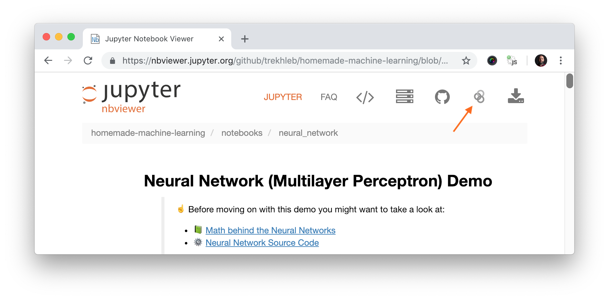

# Machine-Learning-Tutorials

## Introduction
This repositery aims to provide a simple and a comprehensive tutorials for machine learning algorithms. 

## Motivation
Machine Learning, as a tool for Artificial Intelligence, is one of the most widely adopted scientific fields. A considerable amount of literature has been published on Machine Learning. The purpose of this project is to provide the most important aspects of Machine Learning by presenting a series of simple and yet comprehensive tutorials. In this project, we built our tutorials using many different well-known Machine Learning frameworks such as Scikit-learn. 

## Tutorials
The intention of the provided notebooks is to provide a basic understanding of the algorithms and their underlying structure, not to provide the most efficient implementations.

### Supervised Learning
- Linear Regression
- Naive Bayes
- Knn
- SVM
- Decision Tree
- Recommendation Engine

### Unsupervised Learning
- K-means
- Hierarchical clustering
- PCA

## Datasets
The list of datasets using in the different notebooks is be found in data folder.

## Prerequisites
#### Installing Python
Make sure that you have [Python installed](https://realpython.com/installing-python/) on your machine.

#### Installing Dependencies
Install all dependencies that are required for the project by running:

```bash
pip install -r requirements.txt
```

#### Launching Jupyter Locally

All demos in the project may be run directly in your browser without installing Jupyter locally. But if you want to launch [Jupyter Notebook](http://jupyter.org/) locally you may do it by running the following command from the root folder of the project:

```bash
jupyter notebook
```
After this Jupyter Notebook will be accessible by `http://localhost:8888`.

#### Launching Jupyter Remotely

Each algorithm section contains demo links to [Jupyter NBViewer](http://nbviewer.jupyter.org/). This is fast online previewer for Jupyter notebooks where you may see demo code, charts and data right in your browser without installing anything locally. In case if you want to _change_ the code and _experiment_ with demo notebook you need to launch the notebook in [Binder](https://mybinder.org/). You may do it by simply clicking the _"Execute on Binder"_ link in top right corner of the NBViewer.



## License
See the LICENSE file for license rights and limitations (MIT).

